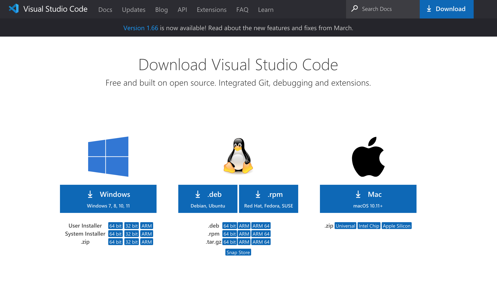
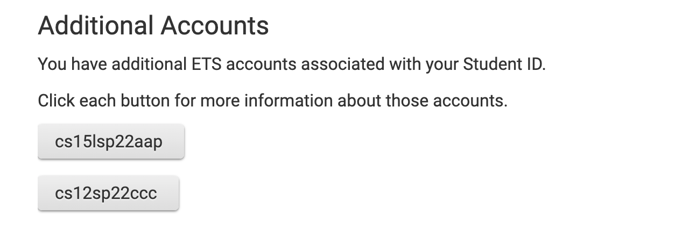
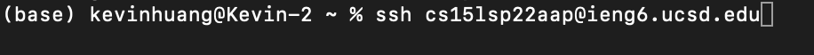
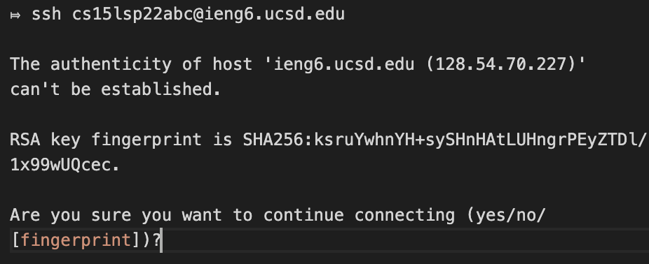
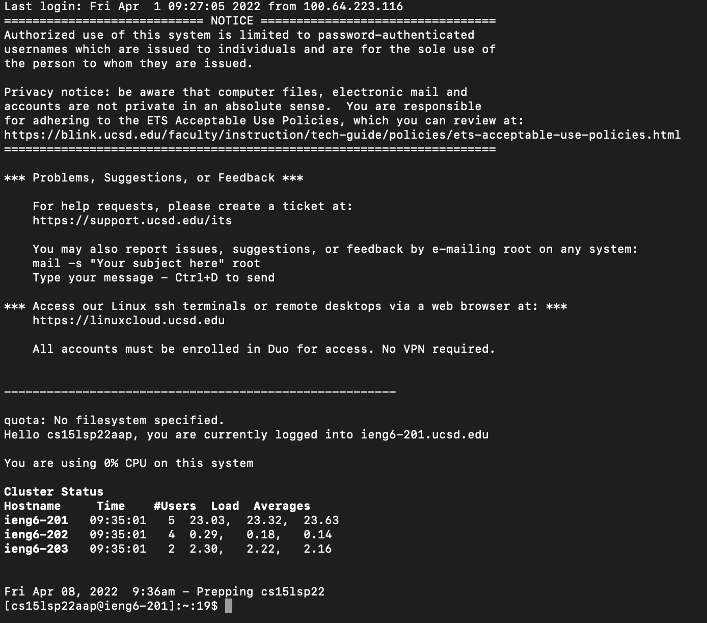
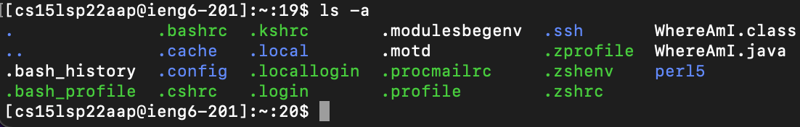

# Lab Report 1 (Week 2)

## How to log into a course-specific account on ieng6

### Step 1: Installing VScode
Install Vscode on your machine if you haven't. Here's the link for downloading Vscode: https://code.visualstudio.com/download. It should look like this: 

### Step 2: Remotely Connecting
1. If you're on Windows, you'll need to install OpenSSH: https://docs.microsoft.com/en-us/windows-server/administration/openssh/openssh_install_firstuse
2. Then, find your account for CSE15L at https://sdacs.ucsd.edu/~icc/index.php. It should look like this: In this case, cs15lsp22aap is my account for CSE15L. Yours should be in the form of cs15lsp22abc.
3. Open your terminal on either Vscode or the terminal for your local machine. Type the following command: `ssh account@ieng6.ucsd.edu` where account should be replaced by your account found in last step. It will look like this: Then, You will see something like this:  Type yes and press enter, then type your password to log in. Once you're logged in, the terminal will look like this:  Now your terminal is connected to a computer in the CSE basement in UCSD.

### Step 3: Trying Some Commands
Try running some commands, both on your local machine and the remote computer

Here's a list of commands you should try:

- cd ~
- cd
- ls -lat
- ls -a
- cp /home/linux/ieng6/cs15lsp22/public/hello.txt ~/
- cat /home/linux/ieng6/cs15lsp22/public/hello.txt

For example, using the command ls -a on the remote computer looks like this: 

Try figuring out what those commands mean on your own. You'll use them later in the course.

### Step 4: Moving Files with `scp`
We can use the command `scp` to copy files from your local machine to the remote computer.

1. First, create a file on your local machine. Make sure you're doing this on your local machine. You can use the command `touch` to create an empty file in your current directory: 

