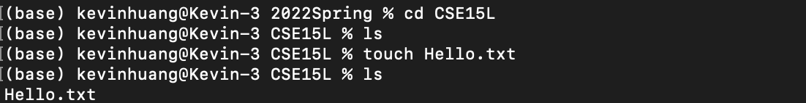

# Lab Report 1 (Week 2)

## How to log into a course-specific account on ieng6

### Step 1: Installing VScode
Install Vscode on your machine if you haven't. Here's the link for downloading Vscode: https://code.visualstudio.com/download. It should look like this: 

### Step 2: Remotely Connecting
1. If you're on Windows, you'll need to install OpenSSH: https://docs.microsoft.com/en-us/windows-server/administration/openssh/openssh_install_firstuse
2. Then, find your account for CSE15L at https://sdacs.ucsd.edu/~icc/index.php. It should look like this: In this case, cs15lsp22aap is my account for CSE15L. Yours should be in the form of cs15lsp22abc.
3. Open your terminal on either Vscode or the terminal for your local machine. Type the following command: `ssh account@ieng6.ucsd.edu` where account should be replaced by your account found in last step. It will look like this: Then, You will see something like this:  Type `yes` and press enter, then type your password to log in. Once you're logged in, the terminal will look like this:  Now your terminal is connected to a computer in the CSE basement in UCSD.

### Step 3: Trying Some Commands
Try running some commands, both on your local machine and the remote computer

Here's a list of commands you should try:

- `cd ~`
- `cd`
- `ls -lat`
- `ls -a`
- `cp /home/linux/ieng6/cs15lsp22/public/hello.txt ~/`
- `cat /home/linux/ieng6/cs15lsp22/public/hello.txt`

For example, using the command `ls -a` on the remote computer looks like this: 

Try figuring out what those commands mean on your own. You'll use them later in the course.

### Step 4: Moving Files with `scp`
We can use the command `scp` to copy files from your local machine to the remote computer.

1. First, create a file on your local machine. For example, `touch Hello.txt`. Make sure you're doing this on your local machine (You can use `exit` to log out from your ucsd account). You can use the command `touch` to create an empty file in your current directory: 

2. Then, run this command in your current directory: `scp hello.txt cs15lsp22abc@ieng6.ucsd.edu:~/`. Type your password when prompted.

3. Then, log in to ieng6 again (`ssh cs15lsp22abc@ieng6.ucsd.edu`), and use the command `ls`, and you should see your file listed: 

### Step 5: Setting an SSH key
Next, we'll set up an SSH key that helps us log in. Basically, you don't have to type your password when log in to ieng6.

1. On your computer, run this command: `ssh-keygen`. You will see something like this:  Don't enter any paraphrase at this point. Just press enter, and you'll see: 

2. If you're on Windows, follow an extra step here: https://docs.microsoft.com/en-us/windows-server/administration/openssh/openssh_keymanagement#user-key-generation

3. Up till this point, we have created the private key in id_rsa and the public key in id_rsa.pub. Now, copy your public key to the .ssh directory of your user account of ieng6. Log in to server (`ssh cs15lsp22abc@ieng6.ucsd.edu`), create a directory called .ssh (`mkdir .ssh`), and log out (`exit`). In your local machine, copy your ssh public key to the server (`scp /Users/<user-name>/.ssh/id_rsa.pub cs15lsp22abc@ieng6.ucsd.edu:~/.ssh/authorized_keys`). Now, try logging into ieng6 using `ssh` and copy using `scp`. For example, `ssh cs15lsp22abc@ieng6.ucsd.edu`. You don't need to type your passport anymore. 

### Step 6: Optimizing Remote Running
Once you make edits to a file on your local machine, you'll often need to copy the file to the remote server and run it. You can combine different commands together in one line to optimize remote running. 

In the following command, after making edits to a WhereAmI.java, I copied it to the server using `scp`, logged in to my account using `ssh`, and ran two java commands. (`scp WhereAmI.java cs15lsp22abc@ieng6.ucsd.edu; ssh cs15lsp22abc@ieng6.ucsd.edu "javac WhwereAmI.java; java WhereAmI"`) Then, I saw the content inside WhereAmI.java being printed:  (Note: you can use `;` to separate commands and write commands in quotes at the end of an `ssh` command to run them on the server.)

