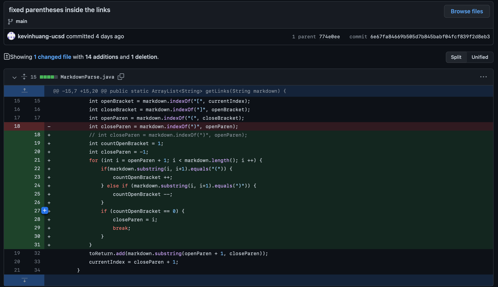
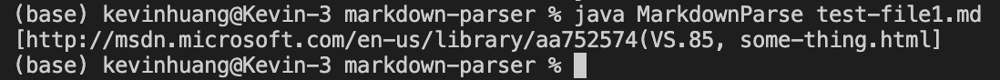
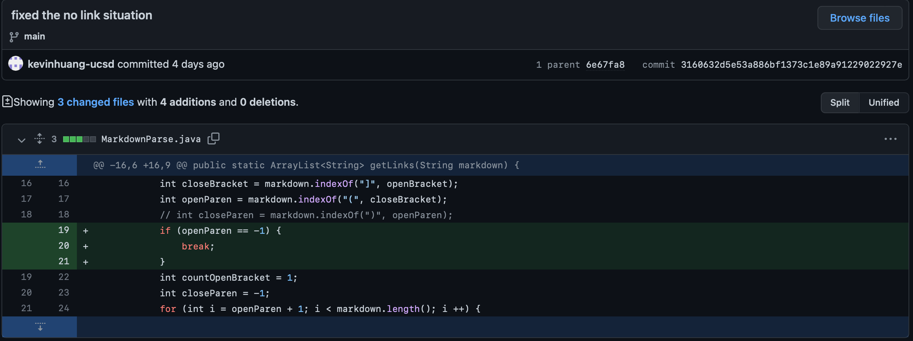
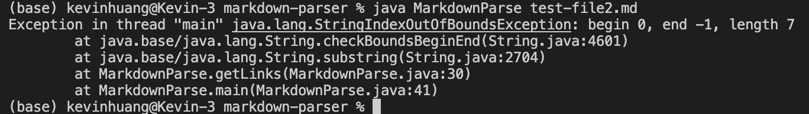
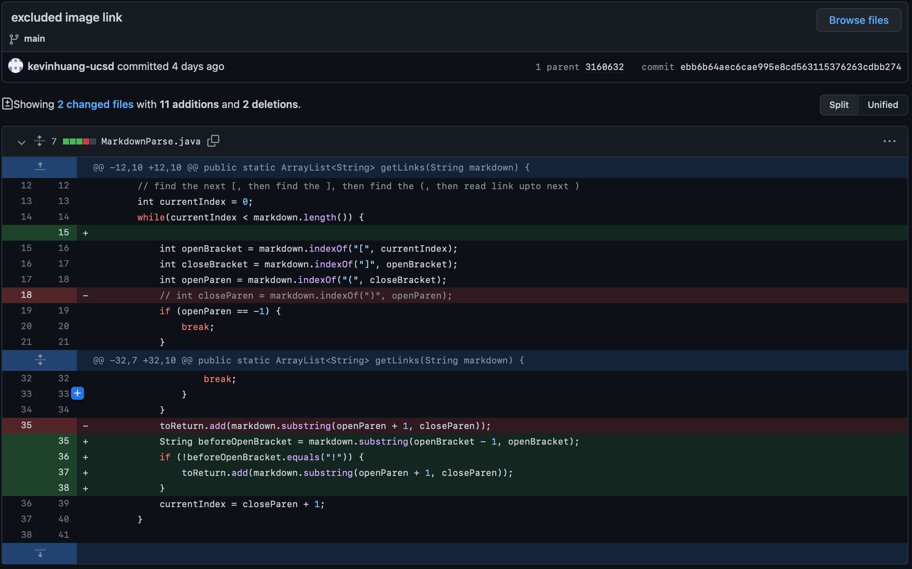
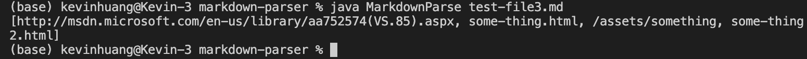
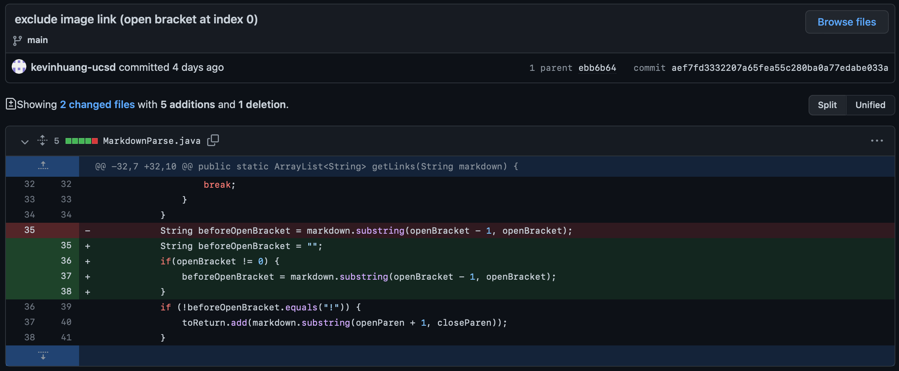

# Lab Report 2 (Week 4)

## Code Changes

### Code Change 1 (Parenthesis inside links)
- Screenshot of the code change diff  
- Link to the test file for a failure-inducing input that prompted you to make that change: [Test File 1](https://github.com/kevinhuang-ucsd/markdown-parser/edit/main/test-file1.md)
- The symptom of that failure-inducing input: 
- The bug: the program falsely locate the end of a link if the link contains parentheses. The symtom: if any of the link contains parentheses, the link is only partially printed in the output. Failure-inducing input: links that contain parentheses.

### Code Change 2 (No link)
- Screenshot of the code change diff  
- Link to the test file for a failure-inducing input that prompted you to make that change: [Test File 2](https://github.com/kevinhuang-ucsd/markdown-parser/edit/main/test-file2.md)
- The symptom of that failure-inducing input: 
- The bug: the program does not deal with the edge case where there is no open parenthesis in the file. The symtom: if the file does not contain a link (specifically, the file does not contain an open parenthesis), it will produce an indexOutOfBoundsException error. Failure-inducing input: A file that does not contain a link (specifically, the open parenthesis).

### Code Change 3 (Exclude Image Link)
- Note: we decided that the output of the program shoudn't include any image link. In other words, it shouldn't include the link in the following form ``. It should only include a link to an external website.
- Screenshot of the code change diff  
- Link to the test file for a failure-inducing input that prompted you to make that change: [Test File 3](https://github.com/kevinhuang-ucsd/markdown-parser/edit/main/test-file3.md)
- The symptom of that failure-inducing input: 
- The bug: the program does not identify whether a link is a "valid" link to an external website or an image link. The symtom: if the file contains an image link, the program will print it in the output. Failure-inducing input: A file that contains an image link.

### Code Change 4 (Open Bracket at Index 0)
- Note: This is a small modification of the previous code.
- Screenshot of the code change diff  
- Link to the test file for a failure-inducing input that prompted you to make that change: [Test File 4](https://github.com/kevinhuang-ucsd/markdown-parser/edit/main/test-file4.md)
- The symptom of that failure-inducing input: 
- The bug: the program does not does not deal with the edge case where an open bracket is the first character of the file (because `markdown.substring(openBracket - 1, openBracket)` would produce an error if `openBracket == 0`). The symtom: if the first doesn't conatin anything before the first link, (i.e. the first character of the file is `[`), the program will produce an indexOutOfBounds error. Failure-inducing input: A file that doesn't conatin anything before the first link, (i.e. the first character of the file is `[`).