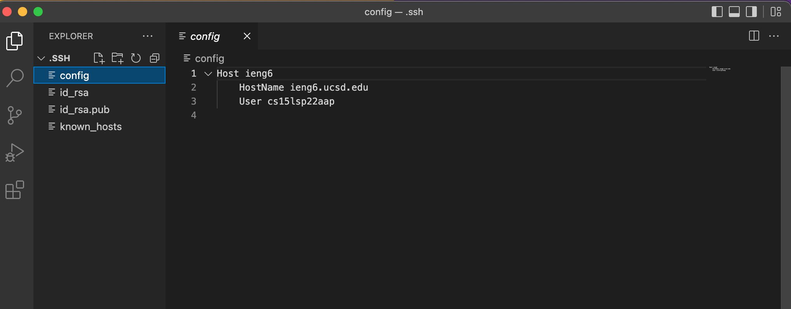

# Lab Report 3 (Week 6)

## Group Choice Options 1 - 3

### Task 1. Streamlining ssh Configuration
- Show your `.ssh/config` file, and how you edited it (with VScode, another program, etc)
 

- Show the `ssh` command logging you into your account using just the alias you chose. Command: `ssh ieng6`

- Show an `scp` command copying a file to your account using just the alias you chose. Command: `scp filename ieng6:~/`

### Task 2 Setup Github Access from ieng6

- Show where the public key you made is stored on Github and in your user account (screenshot).

- Show where the private key you made is stored on your user account (but not its contents) as a screenshot.

- Show running git commands to commit and push a change to Github while logged into your ieng6 account.

- Show a link for the resulting commit. [https://github.com/kevinhuang-ucsd/lab-report3-task2/commit/6fc60b09d934b06b2d7491478077afa3e3a7b06e](https://github.com/kevinhuang-ucsd/lab-report3-task2/commit/6fc60b09d934b06b2d7491478077afa3e3a7b06e)

### Task 3: Copy whole directories with `scp -r`

- Show copying your whole markdown-parse directory to your ieng6 account.
Command: `scp -r markdown-parse ieng6:~/`

- Show logging into your ieng6 account after doing this and compiling and running the tests for your repository.

- Show (like in the last step of the first lab) combining `scp`, `;`, and `ssh` to copy the whole directory and run the tests in one line.
Command: `scp -r markdown-parser ieng6:~/; ssh ieng6 "cd markdown-parser/; javac -cp .:lib/junit-4.13.2.jar:lib/hamcrest-core-1.3.jar MarkdownParseTest.java; java -cp .:lib/junit-4.13.2.jar:lib/hamcrest-core-1.3.jar org.junit.runner.JUnitCore MarkdownParseTest"`

Result:
