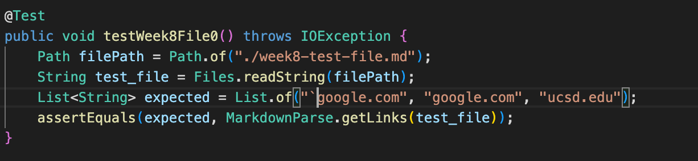
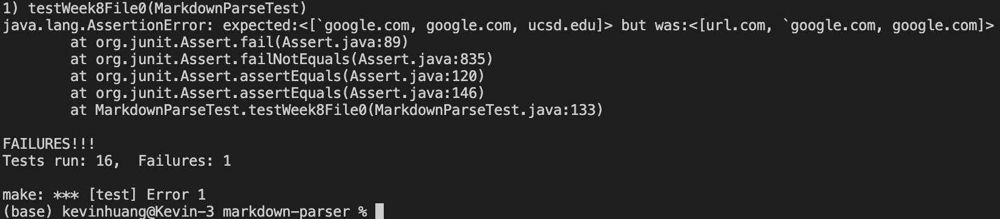
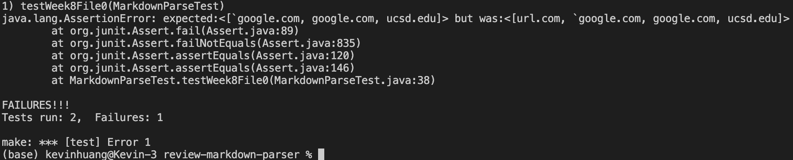
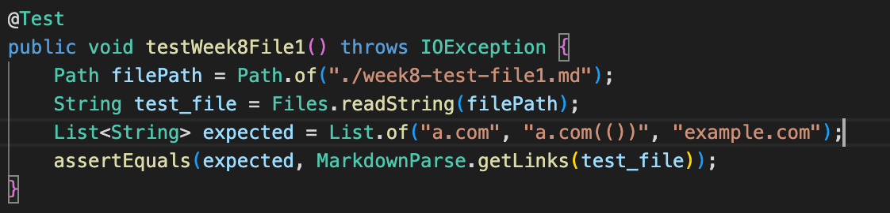
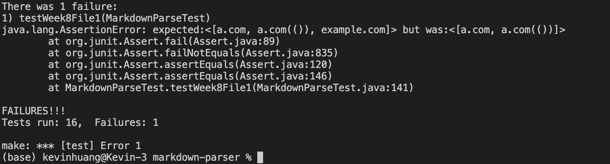
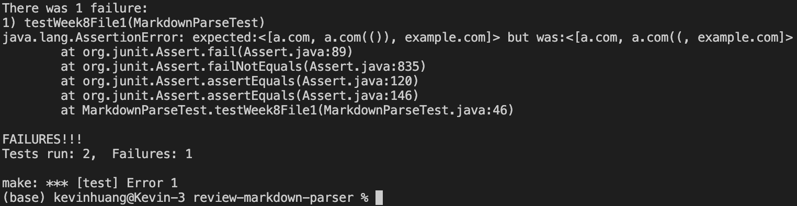
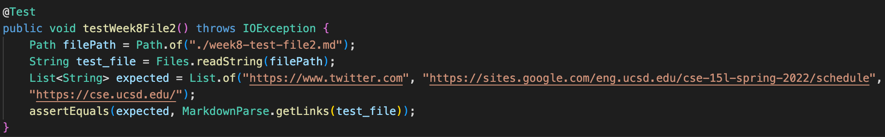
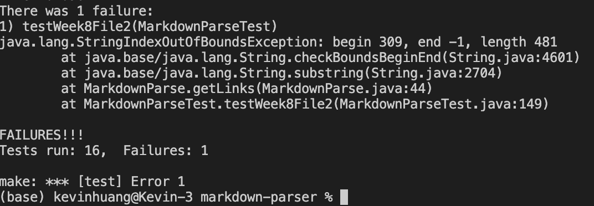
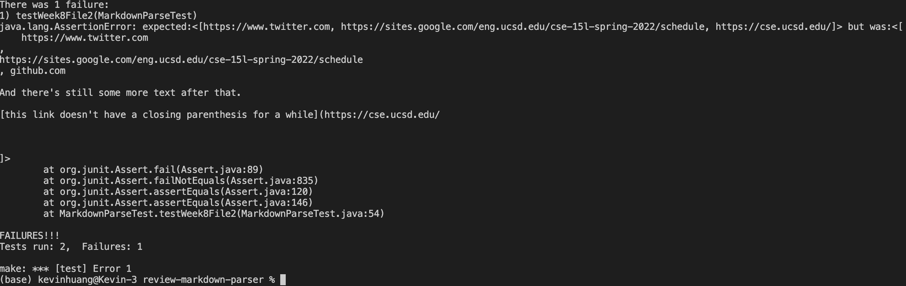

# Lab Report 4 (Week 8)

## A link to your markdown-parse repository and a link to the one you reviewed in week 7
- my markdown-parse repo: [https://github.com/kevinhuang-ucsd/markdown-parser](https://github.com/kevinhuang-ucsd/markdown-parser)
- reviewed: [https://github.com/mrreganwang/markdown-parser](https://github.com/mrreganwang/markdown-parser)

## For Each Test

### Snippet 1
- should produce: ```[`google.com, google.com, ucsd.edu]```
- turned into code: 
- output for my implementation: 
- output for the other implementation: 

### Snippet 2
- should produce: `[a.com, a.com(()), example.com]`
- turned into code: 
- output for my implementation: 
- output for the other implementation: 

### Snippet 3
- should produce: `[https://www.twitter.com, https://sites.google.com/eng.ucsd.edu/cse-15l-spring-2022/schedule, https://cse.ucsd.edu/]`
- turned into code: 
- output for my implementation: 
- output for the other implementation: 

## Answering Questions
- Yes. I could add two if conditions: If there's a backtick before an open bracket, continue the loop (ignore the following link, which is invalid). If there's a backtick after a close bracket, ignore the close bracket and keep searching for a valid close bracket.

- Yes. I could add two if conditions: If there's a backslash before an open bracket, ignore this open bracket. If there's a backslash before a close bracket, ignore this close bracket.

- Yes. When adding a new link to the ArrayList, the command was `toReturn.add(markdown.substring(openParen + 1, closeParen));`, which causes index out of bounds error when the two arguments are invalid. Therefore, I could add an if statement to make sure that the two arguments are within the length of the markdown string before adding. Otherwise, don't add.