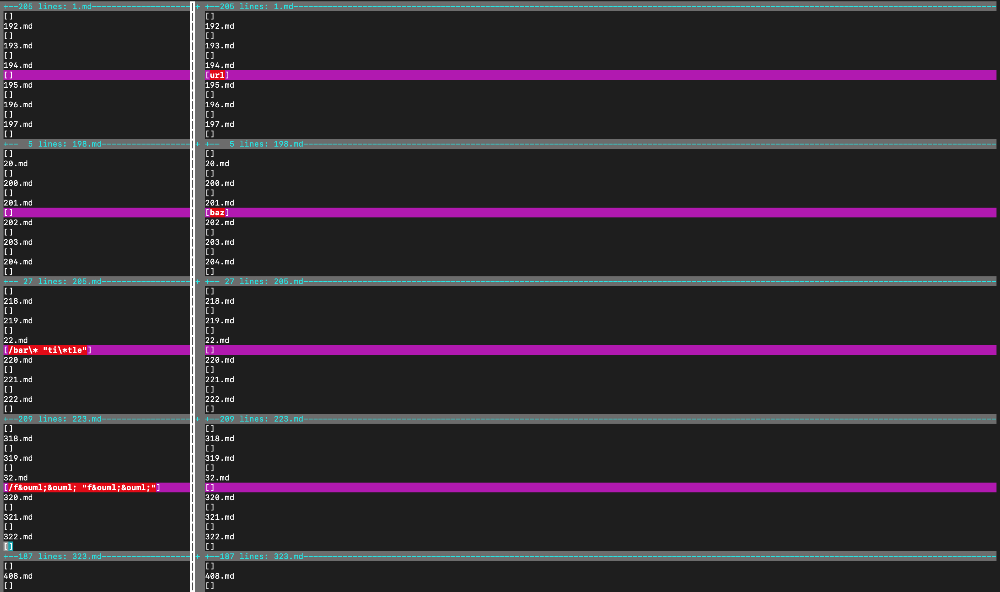
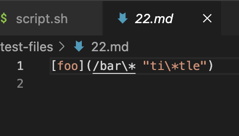
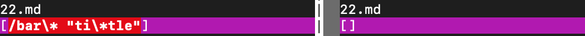
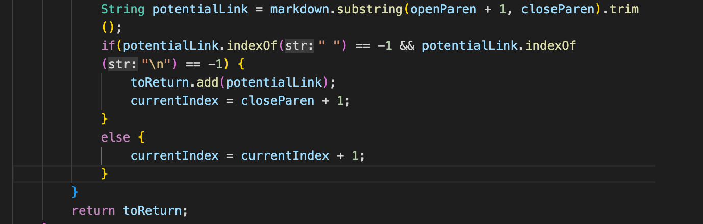
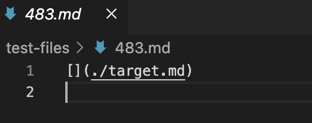
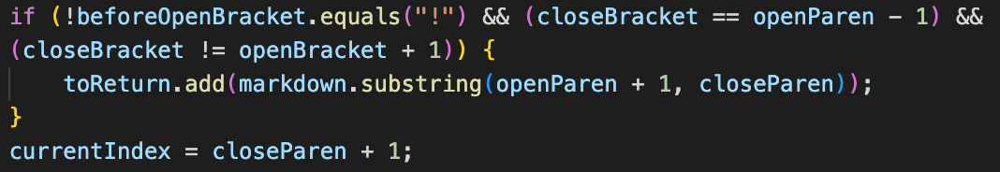

# Lab Report 5 (Week 10)

## Explain:
### How you found the tests with different results?
- I used `vimdiff`. 
### Provide a link to the test-file with different-results
- [https://github.com/nidhidhamnani/markdown-parser/tree/main/test-files](https://github.com/nidhidhamnani/markdown-parser/tree/main/test-files)
### For Each Test
#### 22.md

##### Describe which implementation is correct, or neither if both give the wrong output
- Both of them produced the wrong answer.
##### Indicate both actual outputs (provide screenshots) and also what the expected output is (list the links that are expected in the output)
- 
- left: my markdown parser. right: the provided one
- the expected output should be `[/bar*]`
##### For the implementation that’s not correct (or choose one if both are incorrect), describe the bug (the problem in the code) in about 2-3 sentences. You don’t have to provide a fix, but you should be specific about what is wrong with the program, and show the code that should be fixed (Provide a screenshot of code and highlight where the change needs to be made).
- I chose my implementation.
- The bug is that after getting openParen and closeParen, it should check if there are quotation marks and escape characters inside. It shouldn't including anything inside the quotation marks (not even the quotation marks themselves), and it should inlude the character after the escape character and exclude the escape character.
- Show the code
 (after getting openParen and closeParen, there should be an if statement that checks if there're any quoatation marks inside that range. If there are pairs of quoatation marks, exclude them and the things inside from the link. There should also be an if statement that checks if there're escape characters. If there are, exclude the escape characters.)
#### 483.md

##### Describe which implementation is correct, or neither if both give the wrong output
- The provided markdown parser produced the correct answer while mine did not.
##### Indicate both actual outputs (provide screenshots) and also what the expected output is (list the links that are expected in the output)
- 
- left: my markdown parser. right: the provided one
- the expected output should be `[./target.md]`
##### For the implementation that’s not correct (or choose one if both are incorrect), describe the bug (the problem in the code) in about 2-3 sentences. You don’t have to provide a fix, but you should be specific about what is wrong with the program, and show the code that should be fixed (Provide a screenshot of code and highlight where the change needs to be made).
- The bug is that my code is excluding the link if the brackets have nothing inside them, which is clearly buggy
- Show the code
 (it should delete the `closeBracket != openBracket + 1` part)